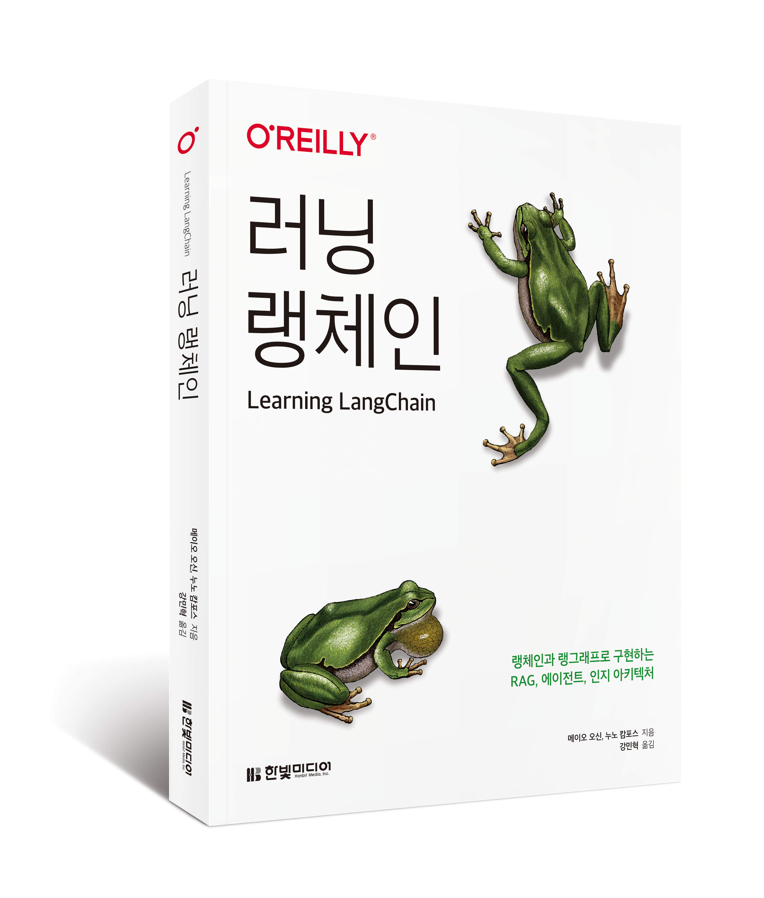

# 러닝 랭체인


### 랭체인부터 랭그래프, RAG, AI 에이전트, 그리고 MCP까지<br>직접 만들며 익히는 생성 AI 애플리케이션 개발의 모든 것

* 지은이 : 메이오 오신, 누노 캄포스 
* 옮긴이 : 강민혁
* ISBN :  979-11-6921-378-3  93000
* 발행일 : 2025년 5월 14일
* 페이지수 : 400쪽
* 정가 : 28,000원
* ISBN: 979-11-6921-378-3
* [원서 실습 코드 저장소](https://github.com/langchain-ai/learning-langchain)


**구매 링크**
* [교보문고](https://product.kyobobook.co.kr/detail/S000216453776)
* [예스24](https://www.yes24.com/product/goods/146327472)
* [알라딘](https://www.aladin.co.kr/shop/wproduct.aspx?ItemId=363882755)


LLM 애플리케이션, 어디서부터 시작해야 할지 막막한가요?
챗GPT 이후의 시대, 검색 증강 생성(RAG), 멀티 에이전트, 랭그래프, MCP 같은 용어들이 쏟아지지만
정작 무엇부터 어떻게 시작해야 할지 고민이라면,
이 책이 지금 꼭 필요한 이유입니다.

이 책은 LLM 기반 애플리케이션 개발의 효율을 극대화하는 랭체인과, 복잡한 아키텍처 설계를 가능하게 하는 랭그래프를 중심으로, 기초 개념부터 실전 배포·운영까지 전 과정을 체계적으로 안내합니다. 

직접 구현하며 익히는 실습 중심의 구성으로, 다양한 예제로  AI 애플리케이션을 즉시 개발에 적용할 수 있는 실전 역량을 길러줍니다. 특히 부록에서는 AI 에이전트와 외부 시스템을 표준 방식으로 연결하는 최신 기술, MCP를 상세히 소개하여, 빠르게 진화하는 생성 AI 기술 흐름을 반영 했습니다. 

LLM을 활용한 애플리케이션 개발이 처음인 독자에게는 출발점을, 이미 경험이 있는 개발자에게는 한 단계 더 나아갈 수 있는 실전 감각을 제공합니다. 빠르게 변화하는 생성 AI 환경 속에서, 이 책은 랭체인의 핵심 개념부터 실전 적용까지 단계별로 안내합니다. 최신 AI 기술을 활용한 개발 역량을 키워보세요.


## 설치 방법

이 저장소의 코드를 실행하기 위해서는 파이썬이나 자바스크립트 환경이 필요합니다.

**파이썬**

1.  필요한 경우 `.python-version` 파일에 명시된 Python 버전을 설치합니다. (예: pyenv 사용)
2.  가상 환경을 생성하고 활성화합니다. (권장)
    ```bash
    python -m venv .venv
    source .venv/bin/activate  # macOS/Linux
    # .venv\\Scripts\\activate  # Windows
    ```
3.  필요한 라이브러리를 설치합니다.
    ```bash
    pip install -r requirements.txt
    ```

**자바스크립트**

1.  Node.js 및 npm (또는 yarn)을 설치합니다.
2.  프로젝트 루트에서 의존성을 설치합니다.
    ```bash
    npm install
    # 또는 yarn install
    ```
3.  환경 변수 설정이 필요한 경우 `.env.example` 파일을 복사하여 `.env` 파일을 만들고 내용을 채웁니다.


## 사용법

각 실습 코드는 해당 디렉토리 내에서 실행할 수 있습니다.

**파이썬 예제**

```bash
export OPENAI_API_KEY=<오픈AI-API-키>
cd python/ch00  # ch00는 해당 챕터 번호
python 00.xxxxx.py
```

**자바스크립트 예제**

```bash
export OPENAI_API_KEY=<오픈AI-API-키>
cd javascript/ch00 # ch00는 해당 챕터 번호
node 00.xxxxx.js
```

자세한 내용은 도서와 소스 코드를 참고하세요.

---

## 번역서 파일에 Jupyter 노트북 (Colab 실행 가능) 파일을 추가했습니다.

각 챕터의 Python 코드와  **Jupyter 노트북(.ipynb)** 을 제공합니다.

### 주요 특징

| 특징 | 설명 |
|------|------|
| **설명** | 개념 설명 추가 |
| **Ollama 변환** | OpenAI API 대신 무료 로컬 LLM(Ollama)을 사용하도록 변경 |
| **Colab 호환** | Google Colab에서 바로 실행 가능한 환경 설정 셀 포함 |

### 코드 변경 예시 (OpenAI → Ollama)

```python
# 원본 (OpenAI API 필요)
from langchain_openai import ChatOpenAI, OpenAIEmbeddings
model = ChatOpenAI(model='gpt-4o-mini')
embeddings = OpenAIEmbeddings()

# 변경 (무료, 로컬 실행)
from langchain_ollama import ChatOllama, OllamaEmbeddings
model = ChatOllama(model='llama3.2')
embeddings = OllamaEmbeddings(model='nomic-embed-text')
```

### 챕터별 노트북 제공 현황

| 챕터 | 노트북 | 비고 |
|------|--------|------|
| ch01 | 제공 | LangChain 기초, 프롬프트, 체인 |
| ch02 | 제공 | RAG 기초, 벡터 DB |
| ch03 | 제공 | 고급 RAG, Agentic RAG |
| ch04 | 제공 | 메모리 관리 |
| ch05 | 제공 | LangGraph 기본 챗봇 |
| ch06 | 제공 | 에이전트와 도구 |
| ch07 | 제공 | 고급 패턴 (Reflection, Subgraph, Supervisor) |
| ch08 | 제공 | 고급 기능 (Streaming, Interrupt, State) |
| ch09 | 미제공 | LangGraph Cloud 배포 프로젝트 (아래 설명 참조) |
| ch10 | 일부 제공 | 개념 설명 노트북만 제공 (아래 설명 참조) |

### ch09에 노트북이 없는 이유

ch09는 **LangGraph Cloud에 배포하기 위한 프로젝트 구조**입니다:
- 외부 서비스 의존성 (Supabase, LangSmith)
- `langgraph.json`, `pyproject.toml` 등 프로젝트 설정 파일 기반
- 로컬 서버 실행 필요 (`langgraph dev`)

Colab에서 단독 실행이 어려우므로 로컬 환경에서 `python/ch09/README.md`를 참조하여 실습하세요.

### ch10 일부 파일에 노트북이 없는 이유

ch10에는 다음 노트북이 제공됩니다:
- `01-02.retrieve_and_grade.ipynb` - 검색 및 관련성 평가
- `03-06.evaluation.ipynb` - LangSmith 평가 개념 설명

나머지 파일들(`agent_sql_graph.py`, `rag_graph.py` 등)은 **LangSmith 연동이 필수**입니다. LangSmith는 LangChain의 평가/모니터링 플랫폼으로, API 키와 프로젝트 설정이 필요하여 Colab에서 단독 실행이 어렵습니다.

### 권장 학습 방법

| 챕터 | 학습 방법 |
|------|----------|
| ch01~ch08 | Google Colab에서 노트북 실행 |
| ch09 | 로컬 환경에서 배포 실습 |
| ch10 (노트북) | Colab에서 개념 학습 |
| ch10 (평가 스크립트) | LangSmith 계정 생성 후 로컬에서 실행 |
